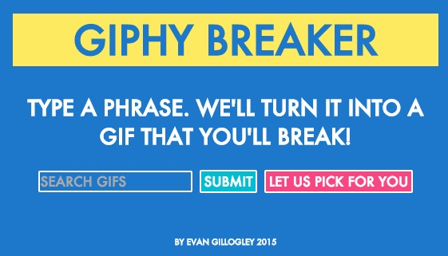
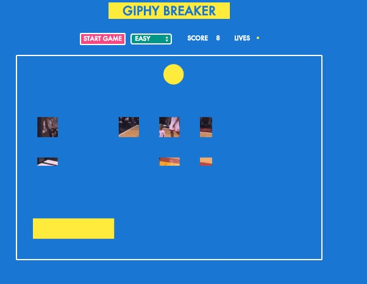

## Giphy Breaker - WDI project 1
# 
Type a Phrase. Giphy Breaker will turn it into a GIF that you can break and collect!
 

Giphy Breaker allows you to put gifs onto breakable blocks.
After winning a level, you can collect the gif and start a new query and game!
 
##PLAY IT: https://giphybreaker.herokuapp.com/

# How It Works:
 Upon receiving a query, the game makes a search request for a Giphy image. Giphy sends a request back to the game and the image is mapped onto the blocks of the game. Since each image has a unique size and shape, each arrangement of blocks is different. You'll never know what you're going to get. 
 
#The Build:
 Giphy API, HTML Canvas, jQuery, CSS, HTML 5, Animate.css, and Javascript to create the game.  
 
#In Development 
-Adding Framerate control
-Improving overall performance of code

 #Difficulties and Bugs:
 The collisions with the ball were the hardest part. Once I got the collisions working and blocks disapearing, implementing the Giphy API was relatively straightforward. There may still be a couple of bugs. If you receive an image that is larger than the canvas, it may automatically win.  

